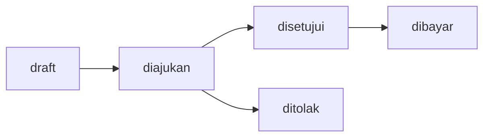
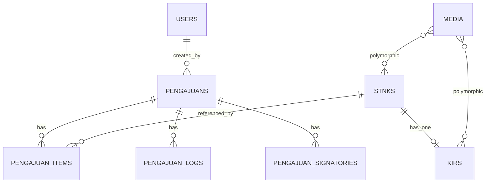

# Ringkasan Laporan Aplikasi Pajak Kendaraan

Tujuan: Membantu karyawan mencatat, memonitor, dan menyiapkan dokumen terkait pajak STNK tahunan dan 5 tahunan serta uji KIR agar tidak dikerjakan manual.

Audiens: Karyawan internal dan admin operasional.

Ringkasan: Aplikasi berbasis Laravel 11 dan Filament 3 menyediakan modul STNK, KIR, Pengajuan dengan ekspor PDF dan upload lampiran. Alur Pengajuan: draft → diajukan → disetujui atau ditolak → dibayar.

Daftar Isi
- Arsitektur Singkat
- Fitur Utama per Modul
- Alur Proses Pengguna
- Alur Status Pengajuan
- Skema Data Inti
- Konfigurasi dan Operasional
- Catatan Kualitas Kode dan Rekomendasi
- Referensi Kode

Arsitektur Singkat

- Panel admin Filament terdaftar di [class AdminPanelProvider extends PanelProvider](app/Providers/Filament/AdminPanelProvider.php:21) dengan path admin, auto-discovery Resources, Pages, Widgets, serta warna utama Amber.
- Resource utama:
  - [class StnkResource extends Resource](app/Filament/Resources/StnkResource.php:23)
  - [class KirResource extends Resource](app/Filament/Resources/KirResource.php:16)
  - [class PengajuanResource extends Resource](app/Filament/Resources/PengajuanResource.php:16)
- Route publik untuk unduh PDF pengajuan berada di [routes/web.php](routes/web.php:9).
- Pustaka kunci: Filament 3, Spatie Media Library plugin, DomPDF.

Fitur Utama per Modul

STNK

- Form identitas dan spesifikasi kendaraan, masa berlaku 1 dan 5 tahun, serta upload lampiran via [Forms\Components\SpatieMediaLibraryFileUpload::make](app/Filament/Resources/StnkResource.php:175).
- Validasi unik nomor polisi pada level form; disarankan menambah unique index DB.
- Tabel berisi identitas dan indikator jatuh tempo (badge merah jika lewat, hijau jika aktif).
- Filter:
  - Kedaluwarsa 1 tahun: [Tables\Filters\Filter::make](app/Filament/Resources/StnkResource.php:277)
  - Akan habis 30 hari untuk 1 tahun: [Tables\Filters\Filter::make](app/Filament/Resources/StnkResource.php:280)
  - Kedaluwarsa 5 tahun: [Tables\Filters\Filter::make](app/Filament/Resources/StnkResource.php:283)
- Bulk action untuk membuat 1 dokumen Pengajuan dari banyak STNK terpilih: [Tables\Actions\BulkAction::make](app/Filament/Resources/StnkResource.php:296) yang membuat Items dengan [PengajuanItem::create()](app/Filament/Resources/StnkResource.php:328) dan merefresh total via [public function recalcTotals()](app/Models/Pengajuan.php:114).

KIR

- Form input KIR terhubung ke STNK yang aktif dan belum memiliki KIR, melalui relasi [Forms\Components\Select::make](app/Filament/Resources/KirResource.php:32).
- Upload lampiran KIR via [Forms\Components\SpatieMediaLibraryFileUpload::make](app/Filament/Resources/KirResource.php:92).
- Tabel dengan indikator kedaluwarsa dan filter Akan Habis 30 Hari: [Tables\Filters\Filter::make](app/Filament/Resources/KirResource.php:163).

Pengajuan

- Form menampilkan placeholder ringkasan nomor dokumen, status, pembuat, dan total: [public static function form](app/Filament/Resources/PengajuanResource.php:24).
- Tabel daftar pengajuan dengan badge status dan filter status: [public static function table](app/Filament/Resources/PengajuanResource.php:76).
- Items Relation Manager: mencegah duplikasi STNK dalam satu pengajuan dengan rule kustom [->rules](app/Filament/Resources/PengajuanResource/RelationManagers/ItemsRelationManager.php:41); isi snapshot data STNK, hitung subtotal dan tampilkan masa berlaku.
- Logs Relation Manager: tampilan audit trail status [class LogsRelationManager extends RelationManager](app/Filament/Resources/PengajuanResource/RelationManagers/LogsRelationManager.php:10).
- Header actions pada halaman edit:
  - Submit: ubah status ke diajukan, validasi minimal 1 item. Lihat [Actions\Action::make submit](app/Filament/Resources/PengajuanResource/Pages/EditPengajuan.php:22) dan [public function markSubmitted()](app/Models/Pengajuan.php:128).
  - Approve: [public function markApproved()](app/Models/Pengajuan.php:145).
  - Reject: form alasan, [public function markRejected()](app/Models/Pengajuan.php:161).
  - Mark Paid: [public function markPaid()](app/Models/Pengajuan.php:177).
  - Export PDF: buka URL export dengan parameter header dan penandatangan: [Actions\Action::make export_pdf](app/Filament/Resources/PengajuanResource/Pages/EditPengajuan.php:101).

Ekspor PDF

- Endpoint: [PengajuanPdfController::show()](app/Http/Controllers/PengajuanPdfController.php:12) menerima parameter query div_dept_cc, keperluan, dan signatories.
- Controller menyimpan parameter header ke DB dan sinkronisasi penandatangan bila dikirim: [PengajuanPdfController::show()](app/Http/Controllers/PengajuanPdfController.php:33).
- Template PDF: [resources/views/pengajuan/pdf.blade.php](resources/views/pengajuan/pdf.blade.php). Kertas A4 landscape, tabel item dengan subtotal dan total akhir.
- File PDF juga disalin ke storage public: [Storage::disk public put](app/Http/Controllers/PengajuanPdfController.php:72) lalu diunduh ke pengguna.

Alur Proses Pengguna

1. Input data STNK; jika ada, input data KIR untuk STNK terkait.
2. Di daftar STNK, pilih beberapa baris lalu jalankan bulk action Buat Pengajuan untuk membuat dokumen pengajuan berisi item STNK terpilih.
3. Buka Pengajuan, atur admin fee per item bila perlu; subtotal dan total akan dihitung otomatis.
4. Klik Submit untuk mengajukan; Admin melakukan Approve atau Reject; jika disetujui, klik Mark Paid saat pembayaran selesai.
5. Gunakan Export PDF untuk mengunduh dokumen pengajuan.

Alur Status Pengajuan

Skema Data Inti

- Model dan relasi kunci:
  - STNK: [class Stnk implements HasMedia](app/Models/Stnk.php:11) hasOne KIR, soft deletes, koleksi media stnk_attachments.
  - KIR: [class Kir implements HasMedia](app/Models/Kir.php:10) belongsTo STNK, koleksi media kir_attachments.
  - Pengajuan: [class Pengajuan extends Model](app/Models/Pengajuan.php:14) hasMany Items, Logs, Signatories, soft deletes.
  - PengajuanItem: [class PengajuanItem extends Model](app/Models/PengajuanItem.php:10) snapshot nominal pokok dan admin fee, subtotal dihitung otomatis [public function computeSubtotal()](app/Models/PengajuanItem.php:68).
  - PengajuanLog: [class PengajuanLog extends Model](app/Models/PengajuanLog.php:11) audit trail status dan user.
  - PengajuanSignatory: [class PengajuanSignatory extends Model](app/Models/PengajuanSignatory.php:7) daftar penandatangan berurutan.
- Tabel penting didesain oleh migrasi: pengajuans, pengajuan_items, pengajuan_logs, pengajuan_signatories, stnks, kirs, media.

Konfigurasi dan Operasional

- Penomoran pengajuan otomatis [public static function generateNomor()](app/Models/Pengajuan.php:73) dengan prefix dari env PENGAJUAN_PREFIX (default MJM-), format PREFIXYYYYMM-SEQ4.
- Penyimpanan PDF dan media di disk public. Pastikan symbolic link storage disiapkan dan izin folder storage/app/public tersedia.
- Skrip pengembangan: [composer.json](composer.json:37) menyediakan script dev untuk serve Laravel, queue listener, pail log, dan Vite.
- Versi inti: PHP ^8.2, Laravel ^11.31, Filament ^3.3, Vite ^6.

Catatan Kualitas Kode dan Rekomendasi

- Integritas dan validasi:
  - Tambahkan unique index DB untuk stnks.nomor_polisi dan kirs.nomor_uji_kendaraan.
  - Tambahkan indeks untuk pengajuans.status, submitted_at, approved_at, paid_at; stnks.masa_berlaku_1 dan masa_berlaku_5; kirs.masa_berlaku.
- Keamanan dan akses:
  - Tambahkan Policy Filament untuk membatasi aksi Submit, Approve, Reject, Mark Paid berdasarkan role.
- UX dan konsistensi:
  - Samakan displayFormat tanggal KIR [Forms\Components\DatePicker::make](app/Filament/Resources/KirResource.php:67) dengan standar lokal.
  - Validasi bahwa masa_berlaku_5 logis setelah masa_berlaku_1 di STNK.
- Performa:
  - Tambahkan eager loading default atau withCount pada PengajuanResource table untuk relasi counts agar mengurangi N+1.
- Testing:
  - Tambah feature test untuk alur status dan ekspor PDF; unit test untuk nomor dokumen [public static function generateNomor()](app/Models/Pengajuan.php:73) dan perhitungan total [public function recalcTotals()](app/Models/Pengajuan.php:114).

Referensi Kode

- Admin Panel: [class AdminPanelProvider extends PanelProvider](app/Providers/Filament/AdminPanelProvider.php:21)
- STNK Resource: [class StnkResource extends Resource](app/Filament/Resources/StnkResource.php:23) • Model: [class Stnk implements HasMedia](app/Models/Stnk.php:11)
- KIR Resource: [class KirResource extends Resource](app/Filament/Resources/KirResource.php:16) • Model: [class Kir implements HasMedia](app/Models/Kir.php:10)
- Pengajuan Resource: [class PengajuanResource extends Resource](app/Filament/Resources/PengajuanResource.php:16) • Model: [class Pengajuan extends Model](app/Models/Pengajuan.php:14)
- Items Relation Manager: [class ItemsRelationManager extends RelationManager](app/Filament/Resources/PengajuanResource/RelationManagers/ItemsRelationManager.php:17)
- Logs Relation Manager: [class LogsRelationManager extends RelationManager](app/Filament/Resources/PengajuanResource/RelationManagers/LogsRelationManager.php:10)
- PDF Controller: [PengajuanPdfController::show()](app/Http/Controllers/PengajuanPdfController.php:12) • View: [resources/views/pengajuan/pdf.blade.php](resources/views/pengajuan/pdf.blade.php)
- Routing PDF: [routes/web.php](routes/web.php:9)

Lampiran

- Contoh format pengajuan: [contoh_format_pengajuan.pdf](contoh_format_pengajuan.pdf)